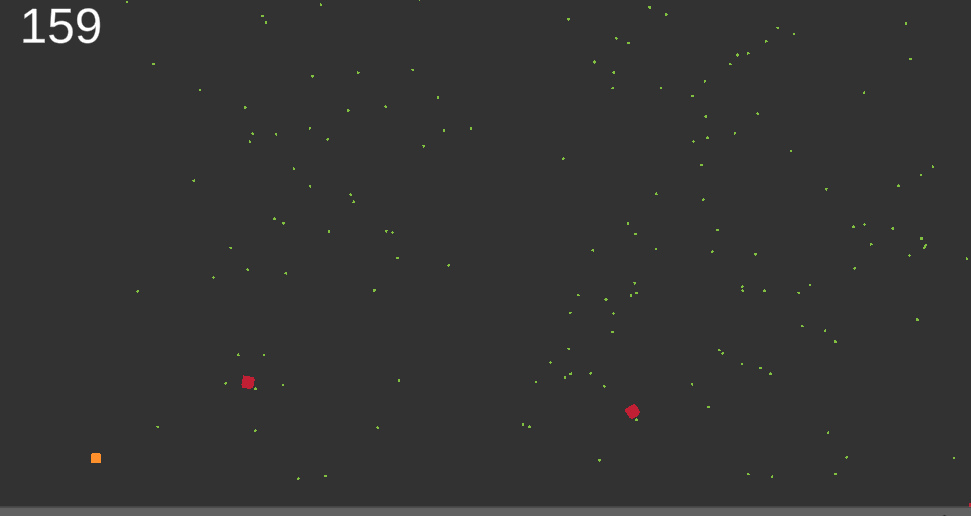

# Game AI School 2019 Jam Game

## Problems

### Insane Prey Spawn Rate

Agents are able to evolve and mate extremely quickly at this point in the game. The problems with this are partially due to size of agent, effectiveness of predator, and time till they can mate again. The first part of the list to focus on is the low hanging fruits. Agents can be reduced in size so they are less likely to touch and we can increase the time until they can mate again. The second part of fixing the predator movement will also fix a bug in general for movemnt. If you look at the predator, red square, on the bottom left of the screen, you'll see that it never moves. Instead it runs around in circles. This represents a bug in my flocking code and needs to be resolved since it not only effects the predators but also the prey.

