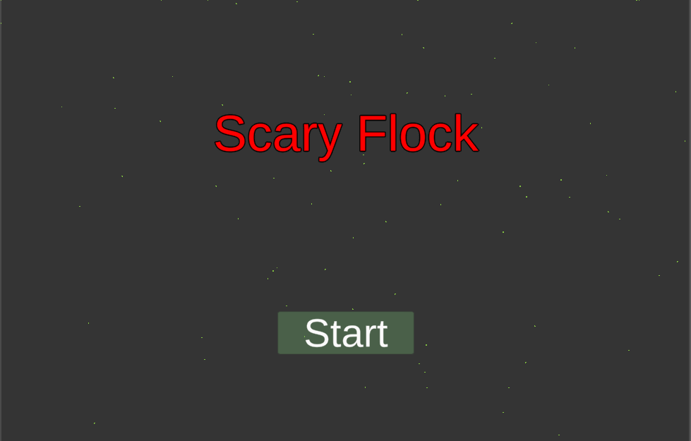
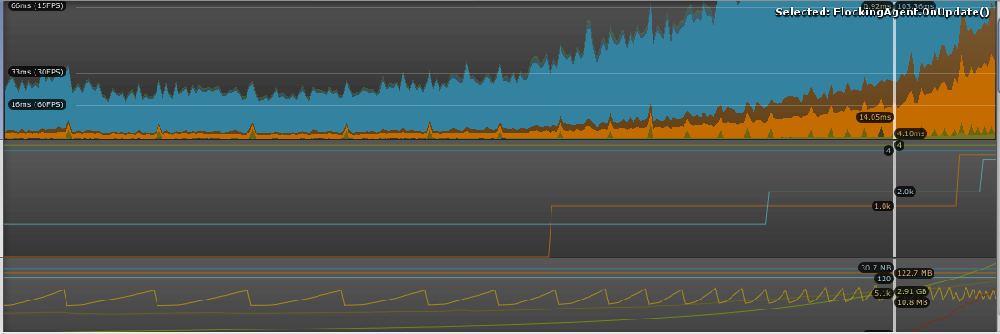

# Game AI School 2019 Jam Game

## How to Play

WASD or arrow keys will move around an orange square/blob you'll find on the bottom left corner of your screen. By colliding with the green things, prey, you'll see that not only does your score increase but new prey are spawned. 

## Evolution and Flocking

When the prey touch eachother they will spawn a new child that has had its parameters set via an evolutionary algorithm. Fitness is based on how many times each parent has mated. Meaning that if `p1` has mated more times that `p2` than `p1`s parameters will have a higher likelihood of being chosen over `p2`s. In addition there is a fifteen percent chance of mutation for a given parameter. A parameter in this context is relates to seven items used in the flocking algorithm you can see being used in the gif below.

1. SearchRadius
2. CohesionWeight
3. SeparationWeight
4. AllignmentWeight
5. WanderWeight
6. AvoidWeight
7. Jitter

The green agent wants a large search radius, cohesion cohesion weight, and avoid weight at the minimum. This is because a large search radius defines how far the agent can see around themselves. The cohesion weight, if large, will cause the agent to approach other agents and thus mate. The avoidance weight, if large, will cause the agent to run away from enemies if found.

## Main Menu

To make the main menu look atleast a bit polished I took spawning code I wrote for the main game and added a boolean that represents whether we are in the menu scene or the game scene. In the menu scene, colliders are turned off and predator spawning is turned off so the number of agents present on the screen is static. The text looks pretty bad but oh well.

## Problems

### Performance

One of the negatives is that we are running a bunch of agents that need to know things about everyone around them. This causes a performance bottleneck which can be seen below. There are a few good fixes like moving to ECS or an inbetween with structs and [Unity Jobs](https://docs.unity3d.com/Manual/JobSystem.html). Because of the time constraint I tried an intermediate step with jobs and converting classes to the required struct but that ended up being slower. The biggest bottleneck is actually finding the agents around one another as opposed to the flocking calculation. To come up with working solution I did two things.

The first was to reduce the amount of searches a round an agent. Originally I had a search for each weight listed above. Now I only do one search and use it for all the weights. This simplified the job of the agents but playtesting didn't reveal this to be the issue.

The second was kind of cheating. Instead of having every agent run flocking calculations every frame I intersperesed them between 1 and 7 frames randomly. This made the evolution not as effective and the players job more difficult but it helped stabilize the game. 

### Insane Prey Spawn Rate

Agents are able to evolve and mate extremely quickly at this point in the game. The problems with this are partially due to size of agent, effectiveness of predator, and time till they can mate again. The first part of the list to focus on is the low hanging fruits. Agents can be reduced in size so they are less likely to touch and we can increase the time until they can mate again. The second part of fixing the predator movement will also fix a bug in general for movemnt. If you look at the predator, red square, on the bottom left of the screen, you'll see that it never moves. Instead it runs around in circles. This represents a bug in my flocking code and needs to be resolved since it not only effects the predators but also the prey.

